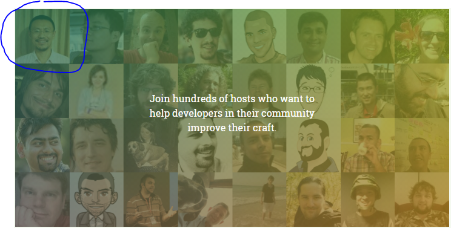



# Coderetreat中国

微信群

# [Coderetreat介绍](http://coderetreat.org/)

Coderetreat is about [Extreme Programming](http://www.extremeprogramming.org/) ([w](https://zh.wikipedia.org/wiki/%E6%9E%81%E9%99%90%E7%BC%96%E7%A8%8B)),
 [Software Craftsmanship](http://manifesto.softwarecraftsmanship.org/#/zh-cn) and [Agile](https://zh.wikipedia.org/wiki/%E6%95%8F%E6%8D%B7%E8%BD%AF%E4%BB%B6%E5%BC%80%E5%8F%91)

## GDCR

<http://gdcr.coderetreat.org/> 2015年11月14日世界上。在中国有8个城市。

时间：  ___ 到  ___

## Read 了解

- [重构Coderetreat：探索简单的设计](http://www.infoq.com/cn/articles/refactoring-coderetreats), in English [Refactoring Coderetreats: In Search of Simple Design](http://www.infoq.com/articles/refactoring-coderetreats)

## Get prepared 准备

- prepare your laptop, preferred runtime and IDE/editor

- read about [Conway’s Game of Life](https://en.wikipedia.org/wiki/Conway%27s_Game_of_Life)

- choose something to practice: writing methods of max 8/6/4 lines of code, immutables only, using no ifs, using no cycles,
name everything precisely, avoid using the mouse at all etc.
While most people think GDCR is about practicing TDD, it is not. [ref](http://www.alexbolboaca.ro/wordpress/articles/how-to-organize-a-code-retreat)

- intro to [Software Craftsmanship](http://www.slideshare.net/alexboly/introduction-to-software-craftsmanship)

- Codereview vs LCT "Let's do commit together"

> Let’s begin with a somewhat obvious observation: 100% of candidates will tell you they support code reviews. Saying you don’t like reviews is tantamount to saying “I drown kittens in my spare time”. A good number of them are lying to you. Why? Because they have had horrible experiences with code reviews, and because those experiences happened when they were very junior, they think that’s what code reviews are. Hopefully this article will help fix that.

quoted from [Code Reviews Can Make or Break Your Team](https://medium.com/swlh/code-reviews-can-make-or-break-your-team-a3cfdcc15de1).

## Where 在哪

- 北京  (2): 1)[北京市西城区广安门外大街朗琴国际大厦B座1607A](http://mp.weixin.qq.com/s?__biz=MzI2OTAwOTMwMQ==&mid=211819044&idx=1&sn=3dd4835ef79cd993b22f852d55137c7d&scene=1&srcid=1015yRi9tBUYms5WpSagRphP&key=b410d3164f5f798e2ffcc8b5a62a1865617ae7d97f60d1c2b4ad33aedf1f085fcddec806307c82af442ed3a5e418ac85&ascene=1&uin=MTU3MzY5ODQ0MQ%3D%3D&devicetype=Windows+8&version=61050016&pass_ticket=9oT9P0TFRo58WDhhjt3xc95II6dTFuHVj8ZTI0qs%2By6sxx87TYikYiX2du0URk1Q)
2) 清华科技园创新大厦B座1层, 伦贝谢北京地球科技中心
- 天津 :[（天津和平区）天津地铁一号线下瓦房站B口附近（B口出前行30米第一路口左转直走即到）](http://www.huodongxing.com/event/1306924362300) ¥50
- 上海
- 成都: <http://x.eqxiu.com/s/5og01tQv> 很厉害的活动网站
- 西安
- [深圳](shenzhen) :中国深圳市南山区科发路1号富利臻大厦3层思微  ( 同位与[EPAM HackFest](http://epa.ms/HackfestChina) )
- 太原
- 大连
- 杭州

## Register 报名

2015年11月14日GDCR编程静修国际日，

<!--
- 北京站报名链接：<https://jinshuju.net/f/0szA4a#rd>
- 天津站报名链接：<http://www.huodongxing.com/event/1306924362300>
- 上海站报名链接：<https://gdgdocs.org/forms/d/1DOyvCTbvORzZoD7YYD7VNusELUaeu-1-m6Y7TrVf0Fg/viewform>
- 深圳站报名链接：<http://epa.ms/gdcr-shenzhen-cn-2015>
- 成都站报名链接：<https://jinshuju.net/f/VboeQS#rd>
- 大连站报名链接：<http://yihuo.de/activities/153>
-->

- 上海：<https://gdgdocs.org/forms/d/1DOyvCTbvORzZoD7YYD7VNusELUaeu-1-m6Y7TrVf0Fg/viewform>
- 北京 TW：<https://jinshuju.net/f/0szA4a#rd>
- 北京 Tsinghua Science Park: <http://www.meetup.com/Software-Craftsmanship-Beijing/events/226561358/>
- 成都：<https://jinshuju.net/f/VboeQS#rd>
- 天津：<http://www.huodongxing.com/event/1306924362300>
- 深圳：<https://yoopay.cn/event/31126629>
- 太原：<http://yihuo.de/activities/152>
- 大连：<http://yihuo.de/activities/153> 
- 杭州：<http://yihuo.de/activities/154>

## Roles 角色

host 是组织者，他准备场地等等 ..

facilitator 是引导师. 他活动的时候给大家介绍，帮助 ...

Using the film industry as an analogy, the host is the producer (making sure event will happen), whereas the facilitator is 2-in-1
the director (making sure things get done correctly) and main actor on the scene.

## Facilitators 引导者

- 伍斌_Ben

著有《驯服烂代码：在编程操练中悟道》。自93年大学毕业以来，先后做过程序员、项目经理和软件开发咨询师。2013年4月创办全栈开发者的编程操练社区“bjdp.org北京设计模式学习组”，微信号：wubinben28，微信公众号bjdp_org，个人网站：wubinben.com。

coderetreat 第一名 ：-）

- 张敏娜

Daimler大中华有限公司全栈工程师，在手机行业有着12年经验，曾做过需求，技术规划, 测试，配置管理，开发，架构师。

- 何永振

相信优雅的代码会让这个世界变得更美好。最近参与的两个产品分别是：帮助神经外科医生进行术前诊断的脑电信号分析软件，和一款能进行分钟级降雨预报的天气预报app。

- 董强

DQ，专注于Web开发的数学爱好者，乐于探究艺术与技术的结合，曾为“财富桥”初创团队什么都干工程师，现为ThoughtWorks Dev一枚。

- 李小波 Lee Seaborn

## Guests 参加者

经理也会编辑  :smile:

- Gino Marckx

Corey Haines 朋友

Gino Marckx (Toronto, Canada)
Gino is passionate about enjoying work and is responsible for the Agile Competency Center at EPAM.

Immediately after getting his Masters degree in Computer Science at the Ghent University in Belgium, Gino started his career as a programmer with a keen interest in every aspect of software engineering. To date, Gino has gained experience as a programmer, tester, business analyst, process manager, teacher, change agent and assumed various management roles in a variety of companies and industries.

In 2002, Gino started working with some of Belgium's most prominent Agile promoters, joined the Belgian XP/Agile User Group and became actively involved in promoting Agile techniques and practices. After moving to Canada, he co-founded the Toronto Agile Software Development Community. Gino is on the Council of Advisors for the Agile Alliance Board of Directors.
He likes to spend his spare time with family and friends enjoying cycling, travel, art, music, poetry and bragging about the supreme quality of Belgian beer.

## Communities 社区

- [Software Craftsmanship Beijing](http://www.meetup.com/Software-Craftsmanship-Beijing/),
- [北京设计模式学习组](http://www.bjdp.org/),
- [Spring用户组](http://springioug.com/),
- [Eclipse中国](http://www.eclipsechina.org/),
- 深圳软件匠艺小组,
- [深圳JUG](http://szjug.github.io/),
..

## Companies 公司

- 
[亿磐系统 (EPAM Systems)](http://www.epam.com) is hosting GDCR in [20+ locations](https://events.epam.com/events#coderetreat).
 [ref](http://coderetreat.org/group/facilitators/forum/topics/epam-systems-will-host-gdcr-in-20-cities)

 ...

[Edit this page / 编辑此页](https://github.com/coderetreat-china/coderetreat-china.github.io/edit/master/index.md),
[website problem / 告知网站问题](https://github.com/coderetreat-china/coderetreat-china.github.io/issues)
