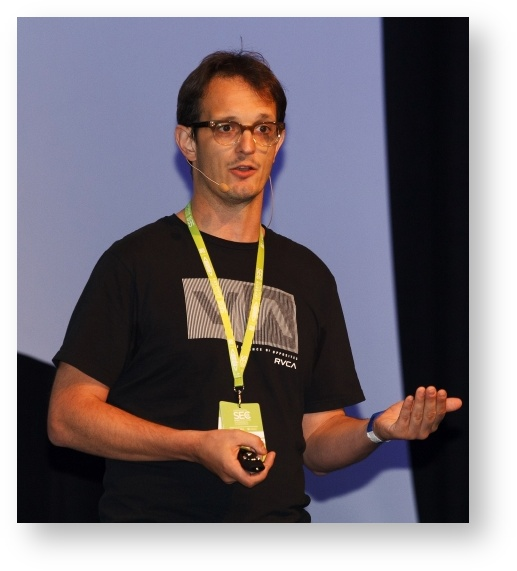

[编辑此页](https://github.com/coderetreat-china/coderetreat-china.github.io/edit/master/index.md),
[告知网站问题](https://github.com/coderetreat-china/coderetreat-china.github.io/issues)

# Coderetreat中国

微信群

# [Coderetreat介绍](http://coderetreat.org/)

Coderetreat is about [Extreme Programming](http://www.extremeprogramming.org/) ([w](https://zh.wikipedia.org/wiki/%E6%9E%81%E9%99%90%E7%BC%96%E7%A8%8B)),
 [Software Craftsmanship](http://manifesto.softwarecraftsmanship.org/#/zh-cn) and [Agile](https://zh.wikipedia.org/wiki/%E6%95%8F%E6%8D%B7%E8%BD%AF%E4%BB%B6%E5%BC%80%E5%8F%91)

## GDCR

<http://gdcr.coderetreat.org/> 2015年11月14日世界上。在中国这个6个城市。

时间：  ___ 到  ___

## Where 在哪

- 北京
- 天津 :[（天津和平区）天津地铁一号线下瓦房站B口附近（B口出前行30米第一路口左转直走即到）](http://www.huodongxing.com/event/1306924362300) ¥50
- 上海
- 成都
- 西安
- 深圳  :中国深圳市南山区科发路1号富利臻大厦3层思微, 同位与[EPAM HackFest](http://epa.ms/HackfestChina)

## Roles

host 是组织者，他准备场地等等 ..

facilitator 是引导师. 他活动的时候给大家介绍，帮助 ...

Using the film industry as an analogy, the host is the producer (making sure event will happen), whereas the facilitator is 2-in-1
the director (making sure things get done correctly) and main actor on the scene.

## Facilitators

- 吴斌  Wu (Bin) Ben 第一名 ：-）

- 李小波 Lee Seaborn

## Guests 参加者

经理也会编辑  :smile:

- Gino Marckx

Corey Haines 朋友

Gino Marckx (Toronto, Canada)
Gino is passionate about enjoying work and is responsible for the Agile Competency Center at EPAM.

Immediately after getting his Masters degree in Computer Science at the Ghent University in Belgium, Gino started his career as a programmer with a keen interest in every aspect of software engineering. To date, Gino has gained experience as a programmer, tester, business analyst, process manager, teacher, change agent and assumed various management roles in a variety of companies and industries.

In 2002, Gino started working with some of Belgium's most prominent Agile promoters, joined the Belgian XP/Agile User Group and became actively involved in promoting Agile techniques and practices. After moving to Canada, he co-founded the Toronto Agile Software Development Community. Gino is on the Council of Advisors for the Agile Alliance Board of Directors.
He likes to spend his spare time with family and friends enjoying cycling, travel, art, music, poetry and bragging about the supreme quality of Belgian beer.

## Communities 社区

- [Software Craftsmanship Beijing](http://www.meetup.com/Software-Craftsmanship-Beijing/),
- [北京设计模式学习组](http://www.bjdp.org/),
- [Spring用户组](http://springioug.com/),
- [Eclipse中国](http://www.eclipsechina.org/),
- 深圳软件匠艺小组,
- [深圳JUG](http://szjug.github.io/),
..

## Companies 公司

- 
[亿磐系统 (EPAM Systems)](http://www.epam.com) is hosting GDCR in [20+ locations](https://events.epam.com/events#coderetreat).
 [ref](http://coderetreat.org/group/facilitators/forum/topics/epam-systems-will-host-gdcr-in-20-cities)

 ...

