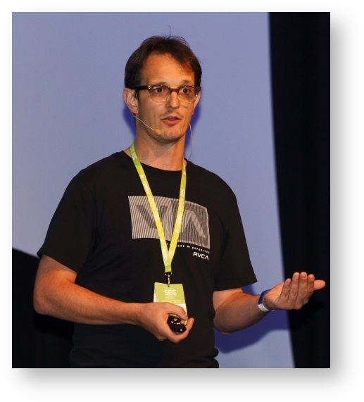



[contact us / 联系我们](https://github.com/coderetreat-china/coderetreat-china.github.io/issues/new)

# Coderetreat 深圳站

11月14日9点到6点 Nomember 14th 9am to 6pm

## Where 在哪

- 深圳  :中国深圳市南山区科发路1号富利臻大厦3层思微  ( 同位与[EPAM HackFest](http://epa.ms/HackfestChina) )

## Register 报名

- [registration page 报名网页](https://yoopay.cn/event/31126629) or below 或者下面

  

- 第二深圳站报名链接：<http://epa.ms/gdcr-shenzhen-cn-2015>
- <http://coderetreat.org/events/global-day-of-coderetreat-2015-shenzhen-china> this is unfortunately note enough.
- EPAM link <https://events.epam.com/events/coderetreat-shenzhen> does not work in China.

## Facilitators 引导者

- 李小波 Lee Seaborn

深圳软件匠艺小组，深圳JUG组织者。

- <a href="https://cn.linkedin.com/pub/paul-verest/10/645/105">Paul Verest</a> 伟保罗

3 time attendee (first in 2011), event host and 1st time facilitator

Java架构师，开发者。 五年在中国，6个月在深圳在 亿磐系统公司。深圳JUG组织者。
对[Nodeclipse](http://www.nodeclipse.org/)和下面的社区有关系。

## Guests 参加者

经理也会编辑  :smile:

- Gino Marckx

Corey Haines 朋友

Gino Marckx (Toronto, Canada)
Gino is passionate about enjoying work and is responsible for the Agile Competency Center at EPAM.

Immediately after getting his Masters degree in Computer Science at the Ghent University in Belgium, Gino started his career as a programmer with a keen interest in every aspect of software engineering. To date, Gino has gained experience as a programmer, tester, business analyst, process manager, teacher, change agent and assumed various management roles in a variety of companies and industries.

In 2002, Gino started working with some of Belgium's most prominent Agile promoters, joined the Belgian XP/Agile User Group and became actively involved in promoting Agile techniques and practices. After moving to Canada, he co-founded the Toronto Agile Software Development Community. Gino is on the Council of Advisors for the Agile Alliance Board of Directors.
He likes to spend his spare time with family and friends enjoying cycling, travel, art, music, poetry and bragging about the supreme quality of Belgian beer.

- Kael Zhang

敏捷技术教练，系统工程师，PMP，深圳软件匠艺推动者。

擅长C++，python，ruby等编程语言，具备丰富的领域建模、代码质量提升、TDD、自动化测试等实战经验。对软件技术社区发展推广亦有贡献，组织多次社区活动（APAC、GDCR、编码道场等）。

目前对函数式编程和erlang语言具有浓厚兴趣。

工作之余喜欢阅读、写作、音乐、运动、研究新事物。

<http://kaelzhang81.github.io/about/>

## Preparation meeting 准备会

[11月5日7点 Thursday 7pm preparation and training for facilitators 准备及引导者培训会](http://coderetreat.org/events/shenzhen-china-preparation-and-training-on-november-5th-7pm)。

## Communities 社区

- [Spring用户组](http://springioug.com/),
- [Eclipse中国](http://www.eclipsechina.org/),
- 深圳软件匠艺小组,
- [深圳JUG](http://szjug.github.io/),
..

## Companies 公司

- 
[亿磐系统 (EPAM Systems)](http://www.epam.com) is hosting GDCR in [20+ locations](https://events.epam.com/events#coderetreat).
 [ref](http://coderetreat.org/group/facilitators/forum/topics/epam-systems-will-host-gdcr-in-20-cities)

##　More events 还有活动

除了EPAM HackFest 11月14日到15日,

on 12-15th Nov.2015 there's also UX event "User Friendly 2015" 还有 UX 活动 11月12日到15日
<http://www.userfriendly.org.cn>. You can find [Mike Jessick there](http://www.userfriendly.org.cn/en/schedule/speech.aspx?id=,830).

[Edit this page / 编辑此页](https://github.com/coderetreat-china/coderetreat-china.github.io/edit/master/shenzhen.md),
[website problem / 告知网站问题](https://github.com/coderetreat-china/coderetreat-china.github.io/issues)
